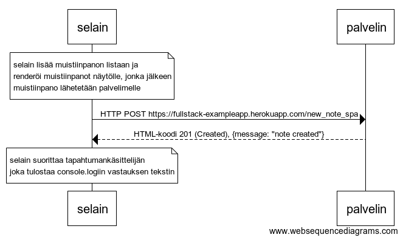

# Osa 0b tehtävät

### 0.4

Kaavio, joka kuvaa mitä tapahtuu tilanteessa, missä käyttäjä luo uuden muistiinpanon ollessaan sivulla https://fullstack-exampleapp.herokuapp.com/notes, eli kirjoittaa tekstikenttään jotain ja painaa nappia tallenna.

### 0.5

Kaavio tilanteesta, missä käyttäjä menee selaimella osoitteeseen https://fullstack-exampleapp.herokuapp.com/spa eli muistiinpanojen Single Page App-versioon

### 0.6

Kaavio tilanteesta, missä käyttäjä luo uuden muistiinpanon single page -versiossa.

